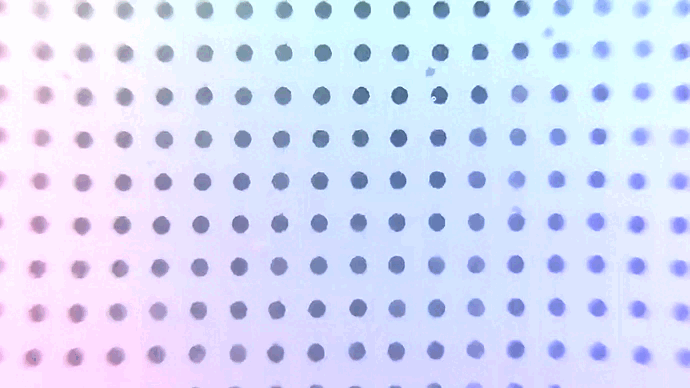

# Gelsight for Baxter Modified Robots

该资源库包含东南大学GelSight的制作、baxter改装机械手模型和采集数据集的c代码。这些代码可实现基本功能，例如查看和保存来自这些设备的数据（图像或视频）。

指导老师：东南大学钱堃

## Gelsight制作

参考gelsight与digit下的Gelsight制作说明
4led.SLDPRT为支架模型

## baxter机械手改装

参考baxter改装模型
gripper_modified_asm.stp为本次使用的改装机械手

## 采集数据集

### requirements

```sudo
sudo apt install ffmpeg
sudo apt install gpac
```

### Linux

``Python 3.8 or above``

### 运行

连接上锐尔摄像头

```sudo
ls /dev/video*
```

查看最新的两个路径（如video2,video3）
将video/encode_video.c中的摄像头的设备文件更改为/dev/video2

```sudo
cd video
gcc -g -O0 encode_video.c -lavformat -lavutil -lavdevice  -lavcodec -o encode_video.exe
./encode_video.exe或者(python photo.py)
```

下面是瓶子全空摇晃采集的视频


## 联系我们

本软件包为东南大学大四16个课时课程设计的参考。如有任何问题/意见/建议，请联系 213203742@seu.edu.cn
